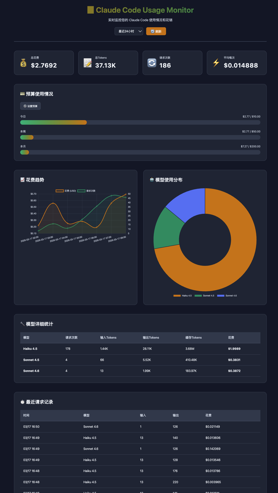

# Claude Code Usage Monitor

<div align="center">

📊 实时监控 Claude Code 的使用情况和花销


</div>

## ✨ 功能特性

- 📊 **实时监控** - 实时查看 token 使用量和成本
- 📈 **数据可视化** - 精美的图表展示使用趋势
- 💰 **花费统计** - 按模型、时间段统计花费
- 🎯 **预算管理** - 设置每日/每周/每月预算限额
- ⚠️ **智能提醒** - 超过预算阈值时自动警告
- 🤖 **模型分析** - 详细的模型使用情况分解
- 📅 **历史记录** - 按小时/天/周/月查看历史数据
- 🖥️ **CLI 工具** - 命令行快速查看统计

## 📸 界面预览

### Web 监控面板

**完整页面（含图表和数据表格）**



页面包含：
- 实时统计卡片：总花费、tokens 使用、请求次数、平均每次成本
- 预算使用进度条：今日 / 本周 / 本月，直观展示预算消耗情况
- 花费趋势图（折线图）和模型使用分布图（饼图）
- 模型详细统计表格（按模型分类汇总）
- 最近请求记录列表

### CLI 命令行工具
- 快速查看关键统计数据
- 支持自定义时间范围
- 查看最近请求记录

## 🚀 快速开始

### 前置要求

- Python 3.8+
- Claude Code 已安装并至少运行过一次
- pip 包管理器

### 安装步骤

1. **克隆仓库**
```bash
git clone https://github.com/yourusername/Claude-Code-Usage-Monitor.git
cd Claude-Code-Usage-Monitor
```

2. **安装依赖**
```bash
pip install -r requirements.txt
```

3. **启动 Web 应用**
```bash
python app.py
```

4. **访问监控面板**
```
在浏览器中打开: http://localhost:5000
```

## 📖 使用指南

### Web 界面使用

#### 1. 主面板
启动应用后，主面板会显示：
- **总体统计**: 总花费、总 tokens、请求次数、平均成本
- **时间范围选择**: 可选择查看最近24小时、7天、30天或所有时间的数据
- **自动刷新**: 每30秒自动刷新数据

#### 2. 预算管理
点击"⚙️ 设置预算"按钮：
- 设置每日预算限额
- 设置每周预算限额
- 设置每月预算限额
- 配置警告阈值（默认80%）

当花费达到设置阈值时，会在页面顶部显示警告提示。

#### 3. 数据可视化
- **花费趋势图**: 展示时间线上的花费变化和请求次数
- **模型分布图**: 饼图显示各模型的花费占比

#### 4. 详细统计
- **模型统计表**: 显示每个模型的详细使用情况
- **最近请求**: 列出最近的20条请求记录

### CLI 工具使用

#### 基本命令

查看所有时间的统计：
```bash
python monitor.py
```

查看最近24小时的统计：
```bash
python monitor.py -t 24
```

查看最近7天的统计：
```bash
python monitor.py -t 168
```

#### 查看最近请求

查看最近10条请求：
```bash
python monitor.py -r
```

查看最近20条请求：
```bash
python monitor.py -r -n 20
```

#### 命令行参数

| 参数 | 说明 | 示例 |
|------|------|------|
| `-t, --hours` | 只显示最近N小时的数据 | `-t 24` |
| `-r, --recent` | 显示最近的请求记录 | `-r` |
| `-n, --limit` | 显示的请求数量（默认10） | `-n 20` |
| `-h, --help` | 显示帮助信息 | `-h` |

#### CLI 输出示例

```
============================================================
  📊 Claude Code 使用统计
============================================================

📅 时间范围: 最近24小时
📝 总请求数: 45
💬 唯一会话: 3

📊 Tokens 使用:
  ├─ 输入 Tokens:  125,430
  ├─ 输出 Tokens:  8,920
  ├─ 缓存 Tokens:  89,200
  └─ 总计:        134,350

💰 花费统计:
  ├─ 总花费:      $2.4567
  └─ 平均每次:    $0.054593

🤖 模型使用分布:
  claude-sonnet-4-5-20250929
    ├─ 请求数:      45
    ├─ 输入 Tokens:  125,430
    ├─ 输出 Tokens:  8,920
    └─ 花费:        $2.4567
```

## 🔧 技术架构

### 后端
- **Flask**: Web 框架
- **Python 3.8+**: 核心语言
- **TelemetryParser**: 自定义解析器，读取 `~/.claude/telemetry` 数据

### 前端
- **HTML5/CSS3**: 页面结构和样式
- **JavaScript ES6+**: 交互逻辑
- **Chart.js**: 数据可视化图表
- **Responsive Design**: 响应式设计，支持移动端

### 数据存储
- **Telemetry Files**: Claude Code 原生遥测文件（`~/.claude/telemetry/*.json`）
- **Budget Config**: JSON 文件存储预算配置（`data/budget.json`）

## 📊 数据来源

监控工具从 Claude Code 的遥测目录读取数据：
```
~/.claude/telemetry/
```

每个遥测文件都是 JSONL 格式，包含：
- `inputTokens`: 输入 token 数
- `outputTokens`: 输出 token 数
- `cachedInputTokens`: 缓存的输入 token 数
- `costUSD`: 单次请求成本（美元）
- `model`: 使用的模型
- `client_timestamp`: 请求时间戳
- `session_id`: 会话 ID

## 🎯 API 端点

### 获取总体统计
```
GET /api/stats/total?hours=24
```

### 获取模型统计
```
GET /api/stats/models?hours=24
```

### 获取时间线数据
```
GET /api/stats/timeline?hours=24&period=day
```

### 获取最近请求
```
GET /api/stats/recent?hours=24&limit=20
```

### 预算管理
```
GET /api/budget              # 获取预算配置
POST /api/budget             # 保存预算配置
GET /api/budget/check        # 检查预算使用情况
```

## ⚙️ 配置说明

### 预算配置文件
位置: `data/budget.json`

```json
{
  "daily_limit": 10.0,
  "weekly_limit": 50.0,
  "monthly_limit": 200.0,
  "alert_threshold": 0.8
}
```

- `daily_limit`: 每日预算限额（USD）
- `weekly_limit`: 每周预算限额（USD）
- `monthly_limit`: 每月预算限额（USD）
- `alert_threshold`: 警告阈值（0-1，0.8表示80%）

### Flask 配置
在 `app.py` 中可以修改：
- `host`: 服务器地址（默认 `0.0.0.0`）
- `port`: 服务器端口（默认 `5000`）
- `debug`: 调试模式（默认 `True`）

## 🔒 隐私和安全

- ✅ 所有数据都存储在本地
- ✅ 不会向外部服务器发送任何数据
- ✅ 仅读取 Claude Code 的遥测文件
- ✅ 不会修改任何 Claude Code 配置

## 🛠️ 故障排除

### 问题：找不到遥测目录
**解决方案**:
- 确保 Claude Code 已安装
- 至少运行过一次 Claude Code
- 检查 `~/.claude/telemetry` 目录是否存在

### 问题：没有数据显示
**解决方案**:
- 确认已经使用过 Claude Code 并产生了一些请求
- 检查时间范围设置，尝试选择"所有时间"
- 查看浏览器控制台的错误信息

### 问题：无法启动 Web 服务
**解决方案**:
- 检查端口 5000 是否被占用
- 确认已安装所有依赖: `pip install -r requirements.txt`
- 尝试使用 `python3` 而不是 `python`

## 📝 开发计划

- [ ] 导出报表功能（CSV/PDF）
- [ ] 更多图表类型（柱状图、热力图）
- [ ] 邮件/通知提醒
- [ ] 多用户支持
- [ ] Docker 镜像
- [ ] 更详细的会话分析
- [ ] 成本预测功能

## 🤝 贡献

欢迎贡献代码！请遵循以下步骤：

1. Fork 本仓库
2. 创建你的特性分支 (`git checkout -b feature/AmazingFeature`)
3. 提交你的更改 (`git commit -m 'Add some AmazingFeature'`)
4. 推送到分支 (`git push origin feature/AmazingFeature`)
5. 开启一个 Pull Request

## 📄 许可证

本项目采用 MIT 许可证 - 详见 [LICENSE](LICENSE) 文件

## 🙏 致谢

- 灵感来源于 [Maciek-roboblog/Claude-Code-Usage-Monitor](https://github.com/Maciek-roboblog/Claude-Code-Usage-Monitor)
- [Flask](https://flask.palletsprojects.com/) - Web 框架
- [Chart.js](https://www.chartjs.org/) - 数据可视化
- [Claude Code](https://claude.ai/claude-code) - Anthropic 开发工具

## 📧 联系方式

如有问题或建议，请通过以下方式联系：
- 提交 [Issue](https://github.com/yourusername/Claude-Code-Usage-Monitor/issues)
- Pull Request

---

<div align="center">
Made with ❤️ for Claude Code users
</div>
